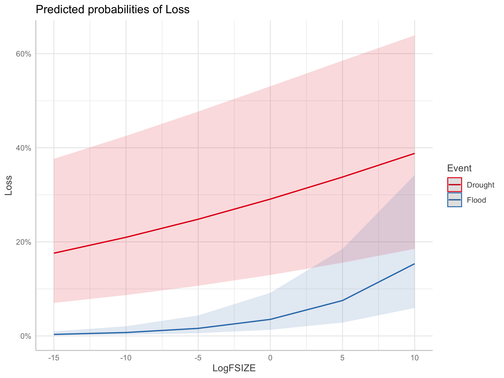
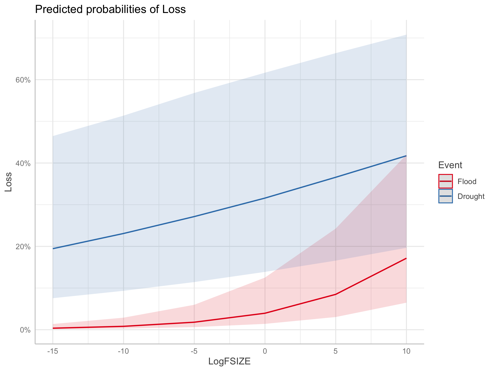
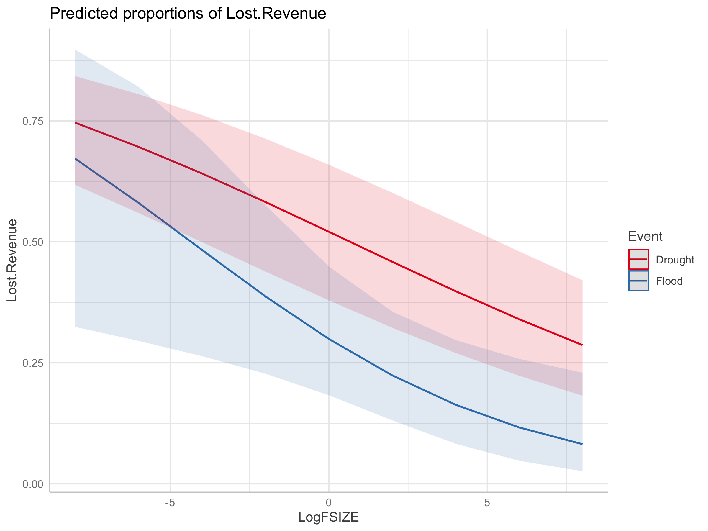

# Agricultural Loss Estimation Analysis

## Overview

This repository contains a statistical analysis of agricultural production losses from climate shocks (drought and flood) as a function of farm size. The analysis builds upon the comprehensive microshock dataset from the [Better Planet Laboratory microshock project](https://github.com/Better-Planet-Laboratory/microshock), which harmonized household survey data across 17 countries to examine the relationship between farm size and climate shock impacts.

## Data Source

The analysis uses the `microdata_spei_merge.RDS` dataset from the microshock project, which combines:

- **Farm size data**: Extracted from household surveys and agricultural censuses across 17 countries (Albania, Bangladesh, Burkina Faso, Colombia, Ethiopia, Guatemala, India, Mali, Malawi, Mexico, Niger, Nigeria, Pakistan, Tanzania, Timor-Leste, Uganda)
- **Climate shock data**: Binary and continuous measures of production losses from droughts and floods
- **SPEI data**: Standardized Precipitation Evapotranspiration Index data for validation of climate anomalies during survey periods
- **Geographic information**: Administrative units at multiple hierarchical levels for spatial analysis

### Countries and Surveys Included

The microshock dataset encompasses:
- 17 countries across Africa, Asia, and Latin America
- Multiple household survey types (LSMS, agricultural censuses, specialized surveys)
- Survey years ranging from 2000-2015
- Over 100,000 households with agricultural production data

## Analysis Structure (Loss_calc.R)

### Data Preparation

#### Farm Size Distribution Analysis
The script begins with exploratory analysis of farm size distributions across countries using the `getdistros()` function, which calculates:
- Weighted median and mean farm sizes by country
- 10th and 90th percentiles
- Min/max farm sizes
- Visualizations using log-transformed farm sizes

#### Data Quality Corrections
Several data quality issues were identified and corrected:

1. **Guatemala outlier correction**: Removed farms ≥1000 ha due to clear data errors
2. **Farm size scaling for specific countries**: Applied scaling corrections for Bangladesh, Ethiopia, and Burkina Faso based on FAO World Census of Agriculture data:
   - Bangladesh: Scaled by ratio to 0.52 ha mean
   - Ethiopia: Scaled by ratio to 1.03 ha mean  
   - Burkina Faso: Scaled by ratio to 4.18 ha mean

#### Variable Transformations
- **Farm size**: Log-transformed (LogFSIZE) to handle skewed distributions, with zero values replaced by 0.0001
- **Household weights**: Rounded to integers and NA/zero values replaced with 1
- **Geographic hierarchy**: Smallest Sampling Unit (SSU) determined using `afn.findssu()` function

### Country Coverage by Analysis Type

#### Binary Loss Analysis (Production Loss Occurrence)
**Countries included**: Albania, Bangladesh, Burkina Faso, Ethiopia, Guatemala, India, Mali, Malawi, Mexico, Niger, Nigeria, Pakistan, Tanzania, Timor-Leste, Uganda
*Note: Colombia excluded due to sample size - alternative sampling approach available*

#### Continuous Loss Analysis (Revenue Loss Percentage)  
**Countries with drought data**: Burkina Faso, India, Mali, Niger, Pakistan
**Countries with flood data**: Niger, Pakistan
*Note: Continuous loss analysis requires specific survey questions about harvest amounts and losses, available in fewer countries*

### Statistical Models

The analysis implements multiple statistical approaches to model the relationship between farm size and production losses:

#### 1. Binary Loss Models

**Model Specification:**
```
Loss ~ LogFSIZE * Event + (1|LVL0/SRAU)
```

**Mathematical Form:**
```
logit(P(Loss = 1)) = β₀ + β₁·LogFSIZE + β₂·Event + β₃·(LogFSIZE × Event) + u₀ + u₁
```

Where:
- `Loss`: Binary indicator (0/1) for production loss occurrence
- `LogFSIZE`: Natural logarithm of farm size in hectares
- `Event`: Factor variable (Drought vs. Flood)
- `u₀ ~ N(0, σ²₀)`: Country-level random effect
- `u₁ ~ N(0, σ²₁)`: SRAU-level random effect nested within country

**Implementation:**
- **Frequentist approach**: `glmer()` with binomial family and logit link
- **Bayesian approach**: `brm()` with Bernoulli family
- **Optimization**: NLOPT_LN_BOBYQA algorithm for likelihood optimization

#### 2. Continuous Loss Models

**Model Specification:**
```
Lost.Revenue ~ LogFSIZE * Event + (1|LVL0/SRAU/SSU)
```

**Mathematical Form:**
```
logit(E[Lost.Revenue]) = β₀ + β₁·LogFSIZE + β₂·Event + β₃·(LogFSIZE × Event) + u₀ + u₁ + u₂
```

Where:
- `Lost.Revenue`: Beta-distributed revenue loss proportion (0,1)
- Three-level nested random effects: Country/SRAU/SSU
- `u₀, u₁, u₂ ~ N(0, σ²ᵢ)`: Hierarchical random effects

**Revenue Loss Calculation:**
Original loss proportions (0, 1) were transformed to avoid boundary issues:
- 0 → 0.00001
- 1 → 0.9999

**Implementation:**
- **Primary model**: `glmmTMB()` with beta family and logit link
- **Alternative approach**: `qgamV()` for quantile regression at median (0.5 quantile)

#### 3. Quantile Regression (Alternative Approach)

**Model Specification:**
```
Lost.Revenue ~ LogFSIZE + LogFSIZE * Event + s(LVL0, bs="re") + s(SRAU, bs="re")
```

**Mathematical Form:**
```
Q₀.₅(Lost.Revenue|X) = β₀ + β₁·LogFSIZE + β₂·LogFSIZE·Event + f₁(LVL0) + f₂(SRAU)
```

Where:
- `Q₀.₅`: Median quantile function
- `f₁, f₂`: Smooth random effect terms
- Implemented using `qgamV()` from mgcViz package

### Model Diagnostics

#### Diagnostic Procedures:
- **DHARMa residual analysis**: `simulateResiduals()` for distributional assumption checking
- **Outlier detection**: Bootstrap-based outlier tests
- **Model validation**: `check()` functions for GAM-based models
- **Convergence diagnostics**: Optimization algorithm convergence monitoring

### Data Filtering and Exclusions

#### Colombia Sampling Strategy:
Due to Colombia's large sample size (>1 million observations), the analysis implements subsampling:
- **Excluded approach**: `binary_loss_nc` and `cont_loss_nc` exclude Colombia entirely
- **Sampling approach**: `afn.samplecolombia()` function for proportional sampling (implementation referenced but not shown)

#### Data Quality Filters:
- **Farm size**: Extreme outliers removed (e.g., 451,973.9 ha observation)
- **Missing values**: Complete case analysis for loss variables
- **Geographic completeness**: Households without administrative unit information excluded

## Key Findings and Model Outputs

### Model Results Storage:
- `model_binary_con.RDS`: Binary loss GLM results
- `model_con.RDS`: Continuous loss GLM results  
- `brms_bin.RDS`: Bayesian binary model results
- `cont_qgam.RDS`: Median regression results

### Visualization Outputs:
- `model_binary_con.png`: Predicted probability of loss by farm size and event type
- `model_con.png`: Predicted revenue loss proportion by farm size and event type
- `model_bin_brms.png`: Bayesian model predictions
- `model_con_gam.png`: Quantile regression predictions

## Key Results and Visualizations

### Binary Loss Models: Probability of Production Loss



*Figure 1: Predicted probability of experiencing production loss by farm size (log scale) for drought and flood events. Based on mixed-effects logistic regression across 15 countries.*



*Figure 2: Bayesian estimates of loss probability by farm size and event type, showing credible intervals for uncertainty quantification.*

### Continuous Loss Models: Revenue Loss Percentage



*Figure 3: Predicted percentage of revenue lost due to climate shocks by farm size. Based on beta regression for countries with detailed harvest/loss data.*


*Figure 4: Median regression estimates of revenue loss, providing robust estimates less sensitive to outliers.*

### Statistical Interpretation:

The interaction term `LogFSIZE × Event` tests the central hypothesis: **Do drought and flood impacts vary differently across the farm size distribution?**

- **β₁ > 0**: Larger farms more likely to experience losses (main effect)
- **β₃ ≠ 0**: Differential farm size effects between drought and flood
- **Random effects variance**: Quantifies between-country and within-country spatial heterogeneity

## Methodological Strengths and Limitations

### Strengths:
1. **Multi-country comparative approach**: 17 countries across diverse agroecological zones
2. **Hierarchical modeling**: Accounts for nested geographic structure
3. **Multiple modeling approaches**: Frequentist, Bayesian, and semi-parametric methods
4. **Comprehensive diagnostics**: Rigorous model validation procedures
5. **Data quality controls**: Systematic corrections for known data issues

### Limitations:
1. **Survey heterogeneity**: Different survey designs and sampling frames across countries
2. **Temporal misalignment**: Survey years span 15-year period with varying climate conditions
3. **Self-reported losses**: Potential measurement error in shock impact assessment
4. **Missing data**: Unbalanced representation across countries and shock types
5. **Causality**: Cross-sectional design limits causal inference

## Technical Implementation Details

### Required R Packages:
- **Core modeling**: `glmmTMB`, `lme4`, `brms`
- **Diagnostics**: `DHARMa`, `mgcViz`
- **Optimization**: `nloptr`
- **Visualization**: `ggplot2`, `ggeffects`
- **Data manipulation**: `dplyr`, `tidyr`
- **Statistical utilities**: `matrixStats`

### Custom Functions:

#### `afn.findssu(data_allcountries)`
Determines the smallest available administrative unit for each household by iteratively checking geographic hierarchy levels (LVL3 → LVL2 → LVL1 → LVL0.5 → LVL0).

#### `weighted_quantile(x, w, probs)` and `weighted_mean(x, w)`
Calculate survey-weighted statistics accounting for complex sampling designs.

#### `nlopt()` optimization wrapper
Custom optimizer configuration for maximum likelihood estimation with NLOPT_LN_BOBYQA algorithm.

## Reproducibility Notes

### File Dependencies:
- Input: `microshock/2.SPEI/2.Output/microdata_spei_merge.RDS`
- Outputs: `Out/` directory with model objects and visualizations
- Random seed: `set.seed(1234)` for Colombia sampling reproducibility

### Computational Requirements:
- Large dataset handling: >100K observations across multiple models
- Mixed-effects optimization: Computationally intensive likelihood estimation
- Bayesian sampling: MCMC chains for uncertainty quantification (brms models)

This analysis provides a rigorous statistical framework for understanding heterogeneous climate risk across the global farm size distribution, with implications for agricultural adaptation and food security policy.